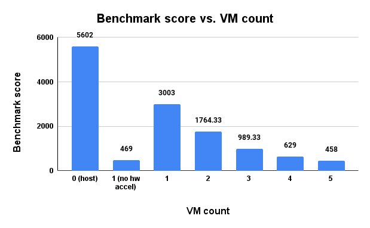

# Performance characterization of GPU-based VDI and virtualized graphics acceleration

This repository contains the RnD-I work on the topic: "Performance characterization of GPU-based VDI and virtualized graphics acceleration". The work is done as part of the course "RnD-I" at IIT Bombay by Anshika Raman (210050014) under the guidance of Prof. Purushottam Kulkarni and Prof. Parag Chaudhuri.

## Abstract

Virtual Desktop Infrastructure (VDI) is a technology that allows users to access their desktops remotely. It is widely used in organizations to provide a secure and efficient way to access desktops. Multiple users connect to the same VDI server and share the resources. The performance of VDI is crucial for the user experience. Graphics acceleration is a technique that improves the performance of VDI by offloading the graphics processing or desktop rendering task to the dedicated GPU(s) instead of the CPU. GPUs are multiplexed and virtualized to support parallelism in desktop rendering. GPUs can be virtualized using different techniques like hardware-assisted virtualization, pass-through and paravitualization. The performance of VDI depends on the virtualization technique used for GPU virtualization. We particularly look into the paravirtualization-based GPU acceleration and VDI and study the performance of VDI. We also evaluate the performance of hardware-accelerated VMs and study the effect of different parameters like the number of users and the support for hardware acceleration.

## Directory Structure

```
.                               # Root directory
├── README.md                   # README file
├── run_hw_accel_vm.sh          # Script to run the hardware-accelerated VM
├── parse_amdgpu_top.py         # Script to parse the output of amdgpu_top command
├── amdgpu_top_profile.json     # A sample output of amdgpu_top command in JSON format
├── report.pdf                  # Report of the work
├── report_src                  # Source files of the report
│   ├── images                  # Images used in the report
│   ├── plots                   # Plots used in the report
│   ├── main.tex                # LaTeX file of the report
│   ├── main.bib                # BibTeX file of the references
└── .gitignore                  # Git ignore file

```

## Pre-requisites

1. A Linux machine with AMD GPU(s) and AMDGPU driver.
2. Virtualization software like QEMU/KVM installed on the machine.
    - First check if the machine supports hardware virtualization by running the following command:
        ```
        egrep -c '(vmx|svm)' /proc/cpuinfo
        ```
        If the output is greater than 0, then the machine supports hardware virtualization.<br/>
        --OR--
    - Run the following command to check if the machine supports hardware virtualization:
        ```
        kvm-ok
        ```
        If the output is `INFO: /dev/kvm exists`, then the machine supports hardware virtualization. If the command is not found, install the `cpu-checker` package using the following command:
        ```
        sudo apt-get install cpu-checker
        ```
        Then run the `kvm-ok` command.
    - Follow the instructions given in the [link](https://help.ubuntu.com/community/KVM/Installation) to install QEMU/KVM on the machine.
3. Python3 and pip3 installed on the machine. A third-party Python package `psutil` is used in the script `parse_amdgpu_top.py`. Install the package using the following command:
    ```
    pip3 install psutil
    ```
4. The machine should have the `amdgpu_top` package installed. It is available as the debian file hosted at the GitHub repository: [link](https://github.com/Umio-Yasuno/amdgpu_top/releases). The `amdgpu_top` command is used to monitor the GPU utilization and performance metrics.

## Running the hardware-accelerated VM

1. Clone the repository using the following command:
    ```
    git clone https://github.com/cloudarxiv/vivid.git
    ```
2. Change the directory to the root directory of the repository:
    ```
    cd vivid
    ```
3. Follow the instructions given in the sections 3.8 and 4.1 from the [report](report.pdf) to create a hardware-accelerated VM and tools required to evaluate the performance of the Graphics Acceleration.
4. Run the following command to start the hardware-accelerated VM:
    ```
    bash run_hw_accel_vm.sh
    ```
5. The script will start the VM and the user will be prompted to enter the password. Enter the password to start the VM.
6. Run the benchmark application in the VM to evaluate the performance of the hardware-accelerated VM.
    ```
    phoronix-test-suite benchmark glmark2
    ```
    Select the resolution of your choice and run the benchmark.
7. Run the following command on the host machine to monitor the GPU utilization and performance metrics:
    ```
    python3 parse_amdgpu_top.py
    ```
    The script will run the `amdgpu_top` command every 1 second to generate the JSON file `amdgpu_top_profile.json` and parse the output to display the GPU utilization and performance as well as cost metrics.

## Results

The results of the work are presented in the [report](report.pdf). The benchmark scores for the hardware-accelerated VMs are presented in the report. Below image highlights the same:

<center>

</center>
<br/>

The GPU utilization and performance metrics are also presented in the report. A [spreadsheet](https://docs.google.com/spreadsheets/d/1hZbSorDnwsLE9Sq_sm1WylsL8ZV26K7jDEhZbVOg9KE/edit?usp=sharing) with all the metric values for each run of the experiment is populated.

## Contributors

Anshika Raman (210050014)

## Acknowledgements

I express my gratitude to my guide, Prof. Purushottam Kulkarni, and my co-guide, Prof. Parag Chaudhuri, for providing me with the opportunity to work on this topic.
